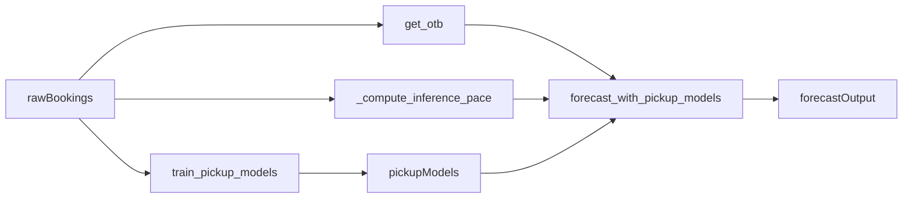

# Replace Forecast With Pickup Model v4

## Goal

Port the v4 pickup-model fixes into the app so forecasting is driven by pickup-trained models (not the current TS total-minus-OTB method), with wash-aware behavior enabled by default.

## Files in Scope

- [d:\Python\Demand-forecast\hotel_demand_forecast.py](d:\Python\Demand-forecast\hotel_demand_forecast.py)
- [d:\Python\Demand-forecast\pickup_model_fix_v4-sonnet46.py](d:\Python\Demand-forecast\pickup_model_fix_v4-sonnet46.py) (reference only)

## Planned Changes

- Add pickup pipeline core into `hotel_demand_forecast.py`:
  - `PICKUP_SNAPSHOT_DAYS`
  - `_compute_inference_pace(...)`
  - `build_pickup_training_data(...)`
  - `PICKUP_FEATURES` and `PICKUP_TARGETS`
  - `_walk_forward_cv_pickup(...)`
  - `train_pickup_models(...)`
  - `forecast_with_pickup_models(..., allow_wash=True)`
- Replace forecast generation callsite to use pickup forecast as primary path (per your selection), removing reliance on `forecast_otb_anchored(...)` for main output flow.
- Update training flow in sidebar action:
  - Train pickup models from `raw_proc` and persist in session state.
  - Store pickup metrics/data/CV in session state for diagnostics.
- Update session-state initialization and persistence keys to include pickup artifacts (models, metrics, pickup_df, pickup_cv).
- Update model quality display to show pickup model metrics and include `Bias` alongside `R²/MAE/MAPE`.
- Align model behavior with v4 fixes:
  - Regression objective for pickup targets.
  - Keep negative pickup targets during training (no wash-flooring in labels).
  - Real inference pace (7d/14d/30d) computed from bookings as-of date.
  - Include `fill_rate` feature consistently in both training and inference.
  - Use v4 LightGBM depth/leaves regularization profile per target type.

## Data/Model Flow After Change

## Validation Plan

- Run static sanity checks in app flow:
  - Train models from uploaded CSV without runtime errors.
  - Forecast executes and returns required columns (`pickup_*`, `total_*`, `otb_*`).
- Verify wash behavior:
  - Confirm negative pickup is possible when model predicts below OTB/final dynamics.
- Verify feature consistency:
  - `fill_rate` exists in training frame and inference feature row.
  - pace fields (`pace_7d/14d/30d`) are non-zero when recent bookings exist.
- Confirm UI metrics:
  - Pickup model quality panel includes `Bias` and expected robust stats.

